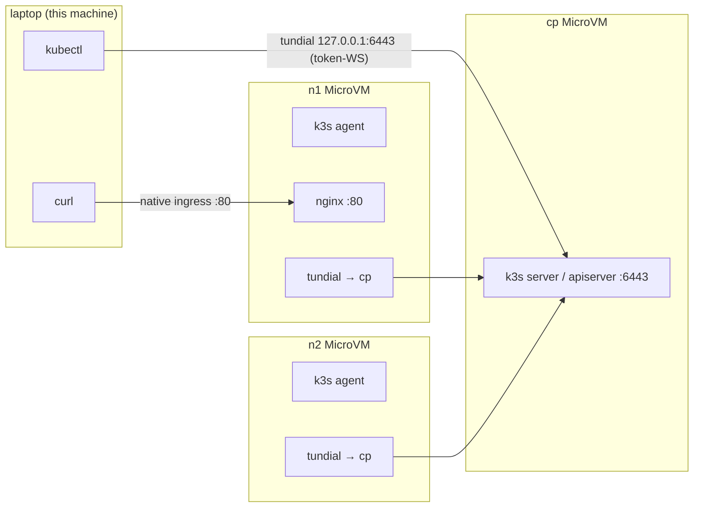

# microvm-fun

This repo contains two projects. I'll start with the quick one.

`microvmssh` allows you to SSH into a Lambda MicroVM. SSH is nice because its
well understood by many tools (e.g. IDEs), allows port-forwarding, file-copying,
etc. Read the README in `microvmssh` to find out more about that.

Everything else is "Kubernetes on Lambda MicroVMs". Specifically, all the code
required to run a k3s cluster across three MicroVMs: a control plane, two
worker nodes and even an internet-accessible(-ish) `nginx` pod.

Why does this exist? Because it can. I wanted to know how fully-featured Lambda
MicroVMs are. The answer: quite fully-featured. If you can partially run a 
Kubernetes cluster across them, you can probably run most other workloads.

Lambda MicroVMs support all OS capabilities out of the box. They're missing 
tun/tap, netfilter modules, /dev/kmesg, but that seems about it. You can run
multiple real pods with real memory/CPU limits on them inside a single MicroVM.
Lambda's come a long way!

The hardest part of getting this up and running was network connectivity. Lambda
MicroVMs support inbound HTTP (in many flavours) with mandatory authentication.
It doesn't support arbitrary TCP, which rules out Kubernetes' default mTLS
cluster-level auth. Instead, some trickery is used to achieve connectivity in
the following scenarios:

* kubelet -> api server (needed to register nodes)
* api server -> kubelet (needed for kubectl logs, kubectl exec, etc)
* kubectl -> api server
* client on the internet -> web app running in a kube pod

All of the above scenarios are effectively authenticated using IAM. It's not 
very granular, but if you deploy this (why though) you're not deploying a
completely naïve RCE-as-a-service. `tundial` is the "secret sauce", but don't
let that make the code sound better than it is. It's just TCP-over-websockets,
but that was all that was needed to get the required connectivity. `tundial`
is used in the first three scenarios listed above. The fourth just uses MicroVMs'
native port-multiplexing supported out of the box.

At one point I had implemented pod<->pod connectivity. I ultimately removed
it because I had sunk too many hours into this and it accounted for about 80%
of the complexity of this repo. TLDR: MicroVMs don't support tun/tap devices,
which would have made everything easier. They do support veth, so I started
tunneling IP-over-websockets but it got to be a real mess. It worked, but it
was too much code for just a silly little project. I can bring it back if someone
really wants. Also happy to receive PRs that implement inter-pod connectivity in
a smarter way.



## Run it

```sh
cd <repo-root>

# 1. build both images (~a few minutes each for the image build)
./build.sh

# 2. bring the cluster up (writes /tmp/kube-minimal.env)
./up.sh

# 3. laptop kubectl
./kubeconfig.sh
export KUBECONFIG=/tmp/kubeconfig.laptop
kubectl get nodes -o wide
kubectl get pods  -o wide

# 4. nginx + native AWS ingress (no tundial)
./nginx.sh

# cleanup
go run ./cleanup -region us-east-1 -prefix microvm-
```

Expected:

```
kubectl get nodes        -> n1 Ready, n2 Ready
nginx.sh                 -> "Welcome to nginx!"      (native ingress -> hostNetwork pod)
```

Tada. It's done. I've spent too much time on this silly thing now. There are 
some further notes in NOTES.md, but they're all AI-written. That might mean they
make more sense than my notes, or they might make less. No promises.
