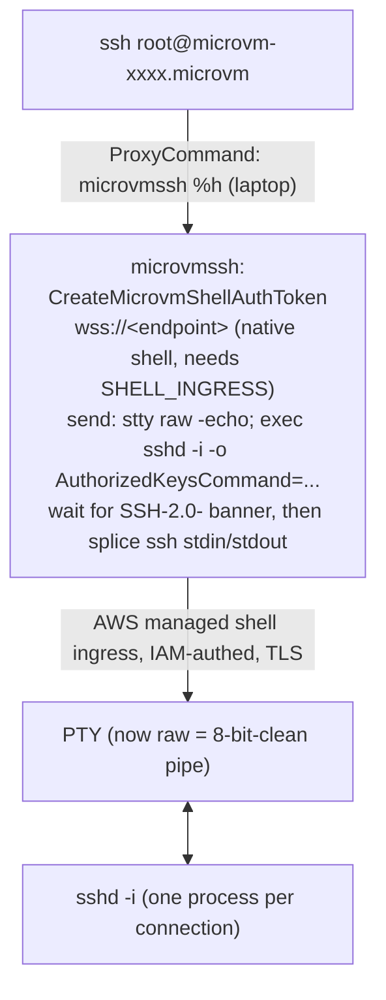

# SSH into a Lambda MicroVM (`ssh root@<id>.microvm`) — no daemon, no keys

You can `ssh root@${microvm-id}.microvm` straight into a running MicroVM with
**no sshd daemon** and **no user ssh keys baked into the image**. SSH rides 
AWS's native shell ingress; `sshd` is spawned per connection in inetd mode 
(`sshd -i`) and exits when you disconnect. The client offers any key and sshd 
accepts it — **IAM is the real authorisation** (you can't open the shell 
without `CreateMicrovmShellAuthToken` permission).

## The minimal image overlay

Making *any* image SSH-able is one build-time `RUN` — nothing runs for SSH, 
nothing to manage:

```dockerfile
RUN dnf install -y openssh-server && \
    ssh-keygen -A && \
    mkdir -p /run/sshd && \
    sed -ri 's/^#?PermitRootLogin.*/PermitRootLogin prohibit-password/' /etc/ssh/sshd_config
# then launch the MicroVM with the managed SHELL_INGRESS ingress connector
```

### Any key is accepted

Because the `sshd -i` command line is injected client-side by `microvmssh`, it
always adds `-o 'AuthorizedKeysCommand=/usr/bin/echo %t %k' -o
AuthorizedKeysCommandUser=root`: sshd's `AuthorizedKeysCommand` echoes the
*presented* key back as an authorized_keys line, so every key matches. That's why
the image carries no keys — IAM is the only authorisation.

## How it works

A MicroVM's native shell ingress (`CreateMicrovmShellAuthToken` + a WebSocket to
the bare endpoint) gives an interactive **PTY** shell. The `microvmssh`
ProxyCommand turns that shell into an SSH transport:



Why the dance: the shell ingress is a *cooked* PTY (echo on, CRLF,
bracketed-paste) which would corrupt SSH's binary protocol. `stty raw -echo`
makes the PTY transparent; `exec` replaces bash with sshd so the channel is now
pure SSH; we discard the prompt/echo up to sshd's `SSH-2.0-` banner.

Observed wire protocol: the server sends a **text** control frame first
(`{"type":"session_init",...}`) then **binary** frames carrying PTY bytes; input
is sent as **binary** frames. [microvmssh/main.go](main.go) skips the
non-binary control frames.

## One-time setup

1. **Build the ProxyCommand**:
   ```sh
   go build -o build/microvmssh ./microvmssh
   ```

2**Build + publish the MicroVM image**. Using the Dockerfile snippet above 

3**ssh config** (`~/.ssh/config`).
   ```
   Host *.microvm
       User root
       IdentitiesOnly yes
       StrictHostKeyChecking accept-new
       ProxyCommand /path/to/microvmssh %h
   ```

## Launch a VM and connect

The MicroVM **must** be launched with the managed `SHELL_INGRESS` connector.
Launch an example image straight from the AWS CLI:

```sh
ID=$(aws lambda-microvms run-microvm --region us-east-1 \
  --image-identifier arn:aws:lambda:us-east-1:123456789012:microvm-image:your-image \
  --execution-role-arn arn:aws:iam::123456789012:role/your-role \
  --ingress-network-connectors arn:aws:lambda:us-east-1:aws:network-connector:aws-network-connector:SHELL_INGRESS \
  --query microvmId --output text)
  
# wait a few seconds for the VM to reach RUNNING

ssh root@${ID}.microvm        
```

Verified end to end against a keyless image: `id` → `uid=0(root)`; interactive
`ssh -tt` gives a nested `/dev/pts/0`; nothing listens on :22 (the only `sshd` is
the per-connection `sshd: root@notty`); and there is no `authorized_keys` file in
the image.

## Notes & limitations

- **The `.microvm` suffix is cosmetic.** No DNS is involved; the ProxyCommand
  strips everything after the first dot and uses the leading `microvm-…` id as
  the `MicrovmIdentifier`. `ssh root@microvm-xxxx` works too.
- **Auth is purely IAM.** The ssh key is not an access factor at all — access is
  whoever can call `CreateMicrovmShellAuthToken` for that VM.
- **Host key.** It's generated once at image-build time (`ssh-keygen -A`), so
  *every* VM from the image presents the **same** host key (verified: identical
  `SHA256:…` fingerprint, comment `root@buildkitsandbox`, across VMs). That's why
  the config uses `accept-new`/`/dev/null` — per-VM TOFU pinning would be
  meaningless. It's not a security gap: server authenticity already comes from
  (a) TLS to `*.lambda-microvm.…on.aws` and (b) the IAM shell token being scoped
  to a specific MicroVM id, so AWS routes you to exactly that VM. The SSH host
  key is redundant on top of that. If you want unique per-VM host keys (e.g. for
  audit), regenerate them on boot via a lifecycle *run* hook
  (`rm -f /etc/ssh/ssh_host_*; ssh-keygen -A`) — but you'd then have to learn each
  fingerprint over the same trusted shell channel, so it adds ops cost without
  adding security over the TLS+IAM guarantees.
- **Token lifetime** is 30 min, but it's only needed to *establish* the session.
- The bootstrap assumes the in-VM login shell can run `stty`/`sshd` (true for the
  al2023 base).
